# Budget Django App Frontend

This functions as the frontend demo for the Budget Django App in this repo: https://github.com/adCva/budget-django

## Packages used.

Redux  
React Icons 

### Screenshots.
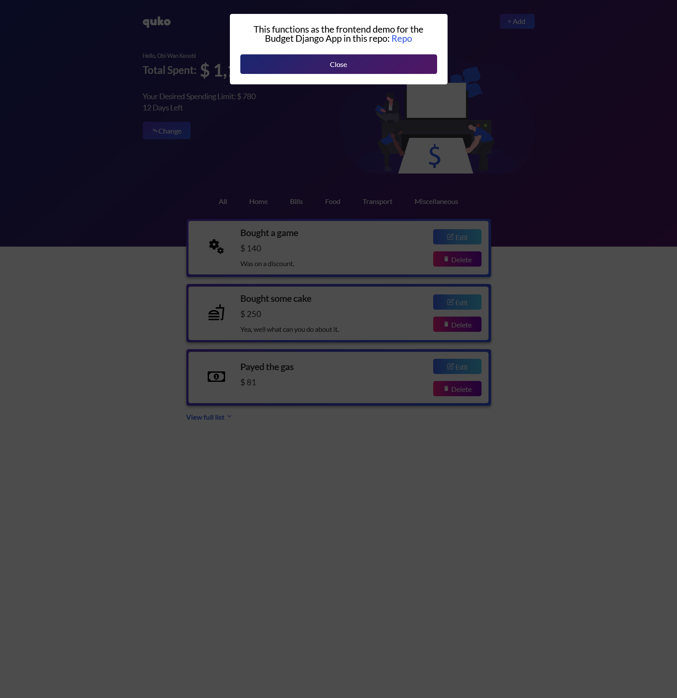 
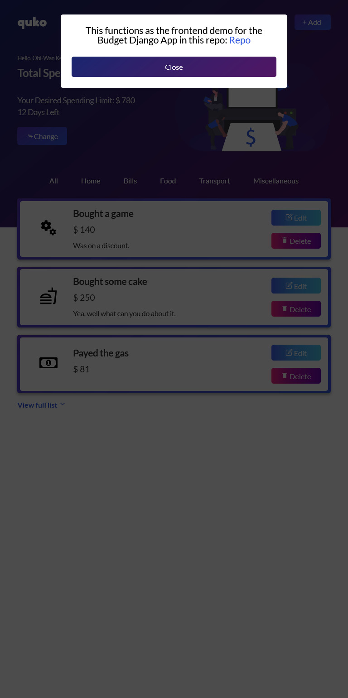 
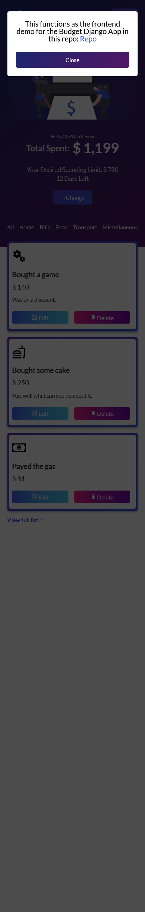 
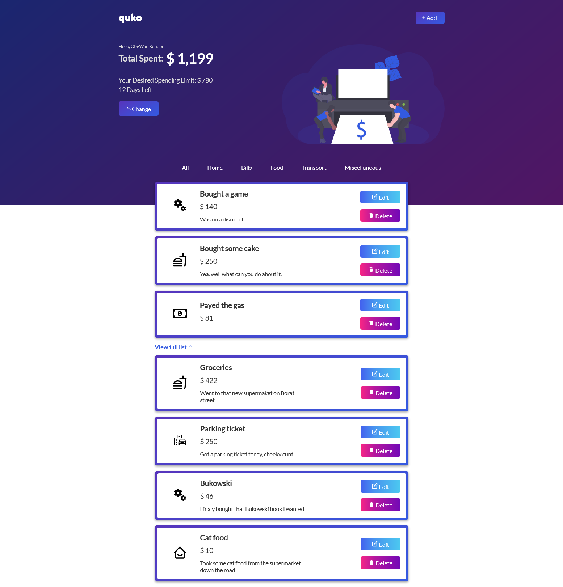 
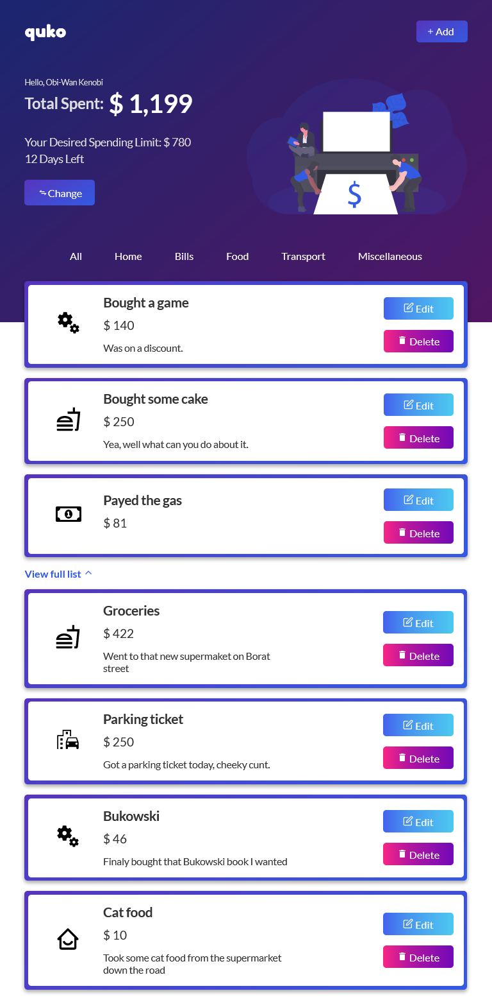 
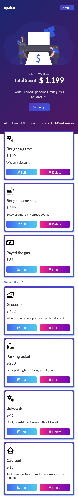 
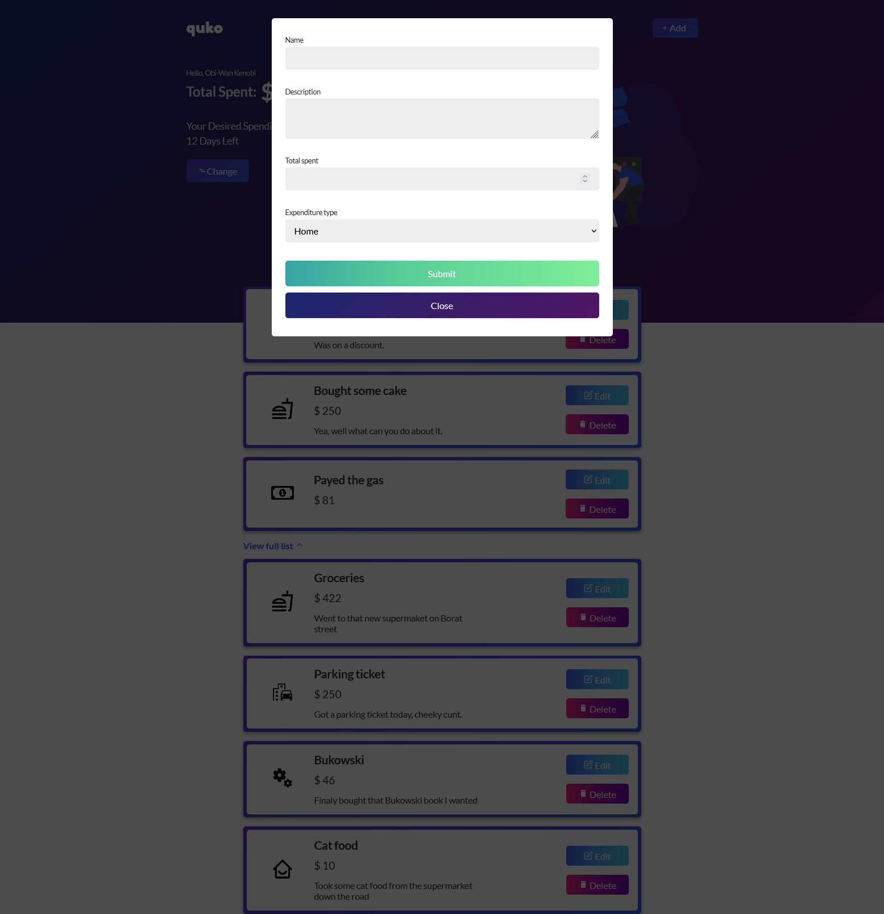 
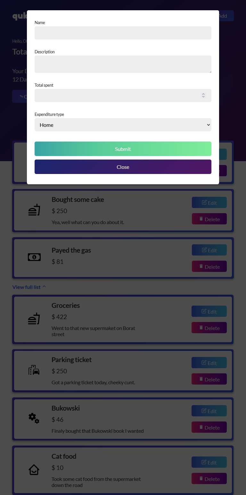 
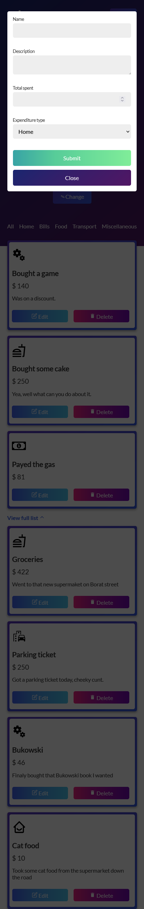 
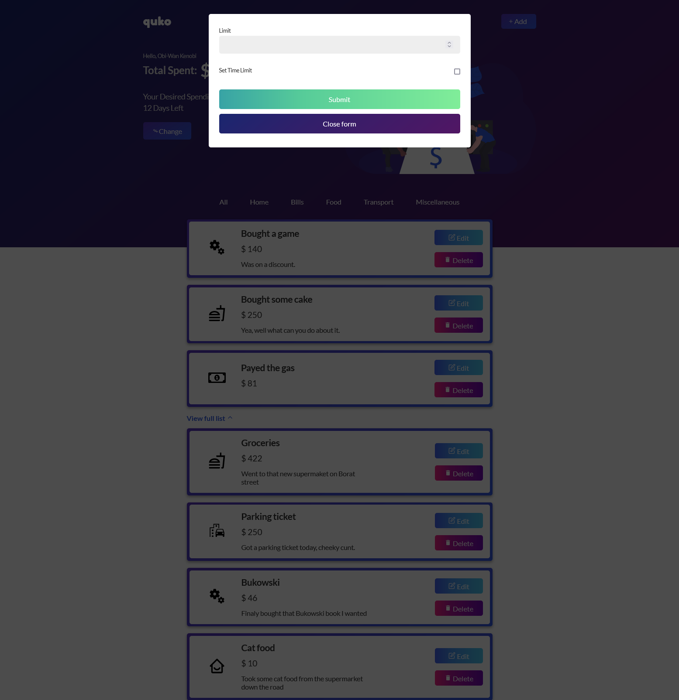 
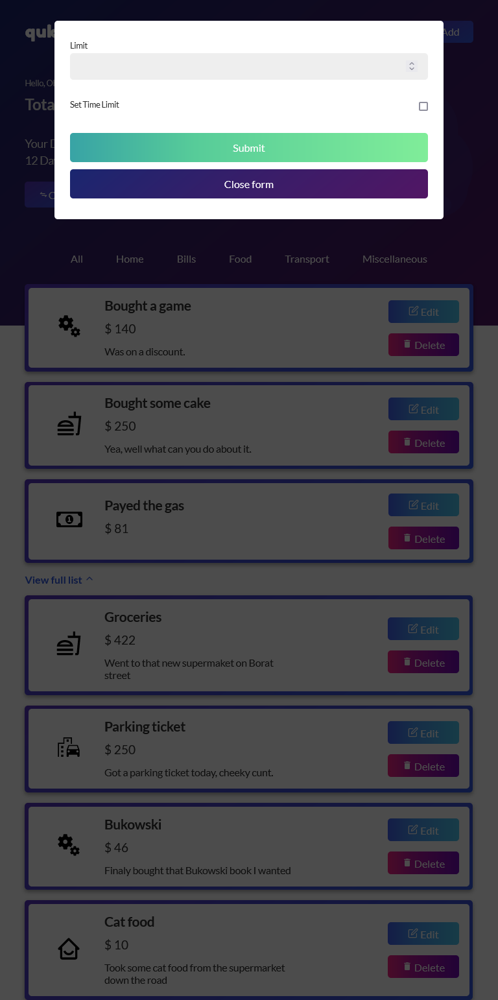 
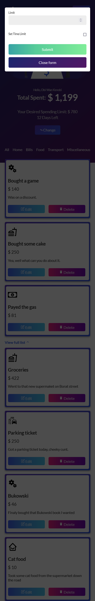 
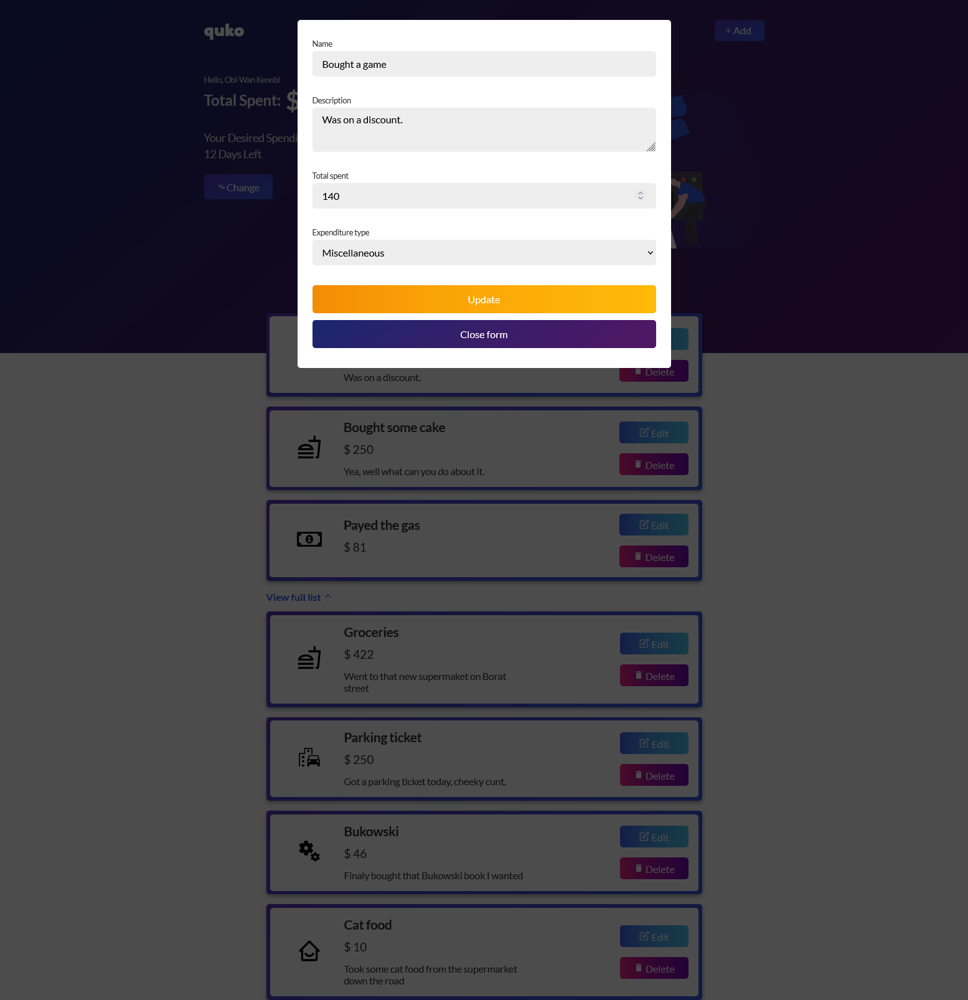 
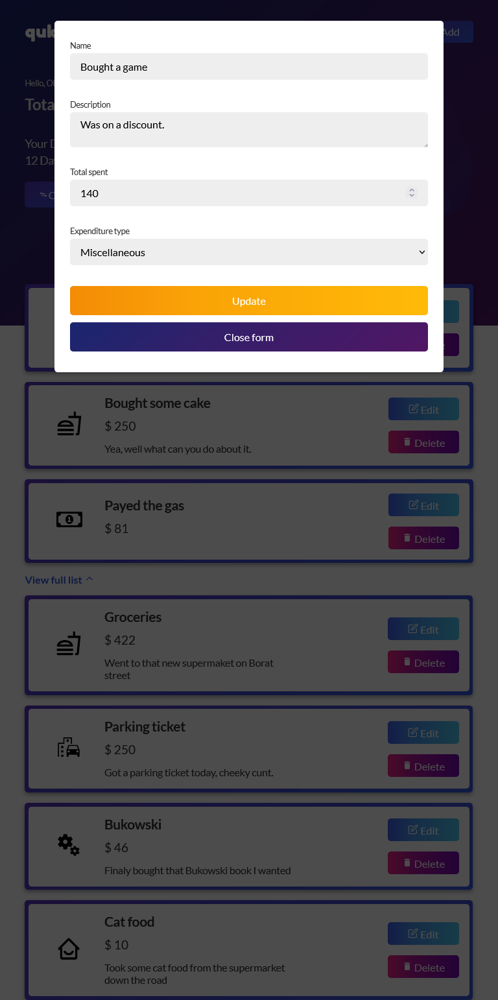 
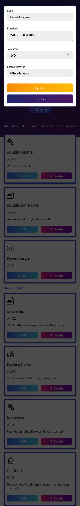 
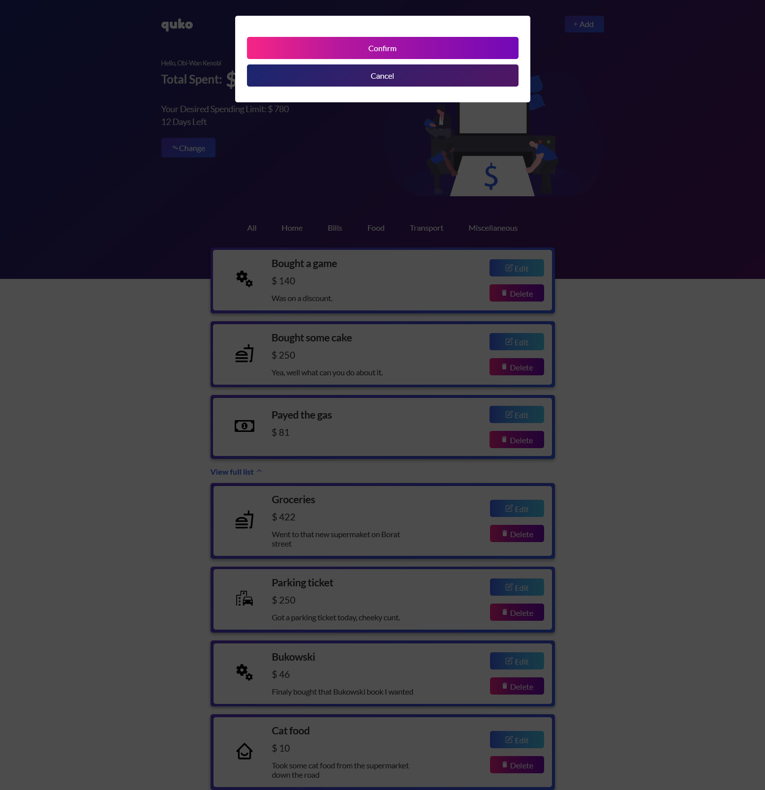 
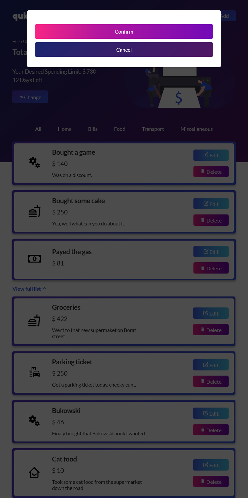 
 